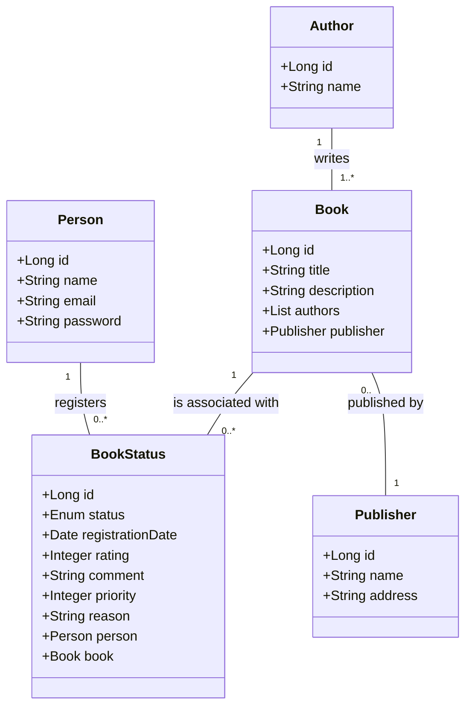
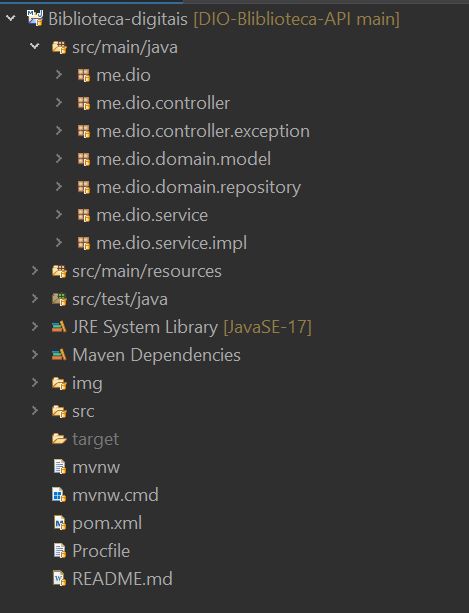

# API REST na Nuvem Usando Spring Boot 3, Java 17 e Railway

<h1 align="center">
    
</h1>

### Descrição do Projeto
Neste projeto, desenvolvi uma API REST utilizando Java 17 e Spring Boot 3 para uma biblioteca, com integração a banco de dados via Spring Data JPA. O objetivo foi criar uma aplicação simples e funcional, com endpoints bem definidos para gerenciar recursos específicos. A API foi implementada com o foco em boas práticas de desenvolvimento e documentação.

Após a criação da API, o próximo passo foi realizar o deploy na nuvem utilizando a plataforma Railway, que facilitou o processo de disponibilização da aplicação sem a necessidade de configurações complexas.

### Objetivos do Projeto:
- Criar uma API REST que seja capaz de receber requisições HTTP e interagir com o banco de dados.
- Garantir uma documentação clara da API, facilitando o uso e entendimento dos endpoints.
- Implementar a aplicação na nuvem, permitindo acesso remoto à API de qualquer lugar.


## ⛏️ Tecnologias utilizadas (Pré-requisitos): 
- Java 17
- Spring Boot 3
- Spring Data JPA
- Swagger
- Railway (para Deploy na Nuvem)
- H2: Desenvolvimento e testes
- PostgreSQL: Produção e escalabilidade

## Figma para Abstração de Domínio

O Figma foi utilizado para a abstração do domínio desta API, sendo essencial na análise e projeto da solução. A ferramenta ajudou a mapear as entidades e a estrutura de dados, garantindo uma visão clara da arquitetura e das interações entre os componentes da aplicação.

### Diagrama de Classes (Domínio da API)
A seguir, você encontrará o Diagrama de Classes, que ilustra a estrutura do domínio da API, as entidades envolvidas e os relacionamentos entre elas.



## 📁 Estrutura de Diretórios do Projeto
Abaixo a função de cada diretório no projeto **DIO-Biblioteca-API**.  
```plaintext
DIO-Biblioteca-API
│── .mvn/                    # Arquivos do Maven Wrapper para compatibilidade entre versões
│── img/                     # Armazena imagens, como diagramas e prints do projeto
│── src/
│   ├── main/
│   │   ├── java/me/dio/       
│   │   │   ├── controller/    # Define os endpoints da API e recebe requisições HTTP
│   │   │   ├── exception/     # Gerencia tratamento de erros e respostas personalizadas
│   │   │   ├── domain/        # Contém as entidades do sistema e suas relações
│   │   │   │   ├── model/     # Modelos de dados mapeados via JPA
│   │   │   ├── repository/    # Interfaces do Spring Data JPA para operações no banco
│   │   │   ├── service/       # Implementa a lógica de negócio da aplicação
│   │   │   ├── BibliotecaDigitaisApplication.java  # Classe principal que inicializa a API
│   │   │
│   │   ├── resources/
│   │   │   ├── application.properties  # Configuração da aplicação no formato .properties
│   │   │   ├── application.yml         # Configuração alternativa no formato YAML
│   │
│   ├── test/java/me/dio/  
│   │   ├── BibliotecaDigitaisApplicationTests.java  # Testes unitários e de integração
│
│── .gitattributes            # Configurações para controle de arquivos no Git
│── .gitignore                # Define arquivos que não devem ser versionados
│── Procfile                  # Necessário para deploy no Railway
│── README.md                 # Documentação principal do projeto
│── mvnw                      # Script para rodar o Maven Wrapper no Linux/macOS
│── mvnw.cmd                  # Script para rodar o Maven Wrapper no Windows
│── pom.xml                   # Configuração do Maven e gerenciamento de dependências

```
Abaixo diretório do projeto no Eclipse
<h1 align="center">
    
</h1>

### 📂 Explicação dos Diretórios  

**DIO-Biblioteca-API**.  

- **`.mvn/`**: Contém arquivos do **Maven Wrapper** para garantir compatibilidade entre versões.

- **`img/`**: Armazena imagens, como diagramas e prints do projeto.

- **`src/main/java/me/dio/`**: Pacote principal da aplicação, dividido em:
  - **`controller/`**: Define os **endpoints da API** e recebe requisições HTTP.
  - **`exception/`**: Gerencia **tratamento de erros** e respostas personalizadas.
  - **`domain/model/`**: Contém as **entidades** do sistema mapeadas via JPA.
  - **`repository/`**: Interfaces do **Spring Data JPA** para operações no banco.
  - **`service/`**: Lógica de **negócio** e processamento de dados.
  - **`BibliotecaDigitaisApplication.java`**: Classe principal que inicializa a API.

- **`src/main/resources/`**: 
  - **`application.properties` / `application.yml`**: Configuração da aplicação.

- **`src/test/java/me/dio/`**: 
  - **`BibliotecaDigitaisApplicationTests.java`**: Testes unitários e de integração.

- **`.gitignore`**: Define arquivos que não devem ser versionados.

- **`Procfile`**: Necessário para **deploy no Railway**.

- **`README.md`**: Documentação principal do projeto.

- **`pom.xml`**: Configuração do **Maven** e dependências.
---

## 🔎 Endpoints da API

### 1. Publisher Controller

- **GET** `/api/publisher/{id}`: Retorna o publisher pelo ID.
- **PUT** `/api/publisher/{id}`: Atualiza o publisher pelo ID.
- **DELETE** `/api/publisher/{id}`: Deleta o publisher pelo ID.
- **POST** `/api/publisher`: Cria um novo publisher.

---

### 2. Person Controller

- **GET** `/api/person/id/{id}`: Retorna a pessoa pelo ID.
- **GET** `/api/person/email/{email}`: Retorna a pessoa pelo email.
- **PUT** `/api/person/{id}`: Atualiza a pessoa pelo ID.
- **DELETE** `/api/person/{id}`: Deleta a pessoa pelo ID.
- **POST** `/api/person`: Cria uma nova pessoa.

---

### 3. Book Status Controller

- **GET** `/api/bookstatus/{id}`: Retorna o status do livro pelo ID.
- **GET** `/api/bookstatus`: Retorna todos os status dos livros.
- **POST** `/api/bookstatus`: Cria um novo status de livro.
- **PUT** `/api/bookstatus/{id}`: Atualiza o status do livro pelo ID.
- **DELETE** `/api/bookstatus/{id}`: Deleta o status do livro pelo ID.
- **GET** `/api/bookstatus/status/{status}`: Filtra livros pelo status.

---

### 4. Book Controller

- **GET** `/api/book/{id}`: Retorna o livro pelo ID.
- **GET** `/api/book`: Retorna todos os livros.
- **POST** `/api/book`: Cria um novo livro.
- **PUT** `/api/book/{id}`: Atualiza o livro pelo ID.
- **DELETE** `/api/book/{id}`: Deleta o livro pelo ID.

---

### 5. Author Controller

- **GET** `/api/author/{id}`: Retorna o autor pelo ID.
- **POST** `/api/author`: Cria um novo autor.
- **PUT** `/api/author/{id}`: Atualiza o autor pelo ID.
- **DELETE** `/api/author/{id}`: Deleta o autor pelo ID.


# 🗺️ Acesso aplicação
- Railway: https://railway.com/
- Swagger: https://genuine-learning-production-6fa5.up.railway.app/swagger-ui/index.html#/


### Capturas de Tela da Execução do Projeto

Aqui estão algumas capturas de tela que ilustram o funcionamento da API e a documentação gerada via Swagger/OpenAPI:

#### Tela 1: Deploy com railway

<h1 align="center">
    
</h1>

<h1 align="center">
    
</h1>

Acessando a Aplicação

<h1 align="center">
    
</h1>


#### Tela 2: Visualização dos Endpoints da API no Swagger
<h1 align="center">
    
</h1>

#### Tela 3: Executando uma Requisição POST para Criar um Novo Recurso

<h1 align="center">
    
</h1>

#### Tela 4: Resultado da Requisição GET para Listar Recursos

<h1 align="center">
    
</h1>

##### Tela 4.1: Resultado da Requisição GET para Listar Recursos

<h1 align="center">
    
</h1>

#### Tela 5: Registro salvo no banco de Dados PostgreSql 

<h1 align="center">
    
</h1>


#  ⚙️ Como Rodar o Projeto Localmente:  <a name = "tinstall"></a>
### Pré-requisitos
```
Java 17
Spring Boot 3
Spring Data JPA
Swagger/OpenAPI
Railway (para Deploy na Nuvem)
H2
PostgreSQL
```
### Instalação
#### 1 - Clone este repositório:
```
git clone https://github.com/viniciosmucheirone/DIO-Bliblioteca-API.git
```
#### 2 - Navegue até o diretório do projeto:
```
cd DIO-Bliblioteca-API
```
#### 3 - Abra o projeto em sua IDE favorita (como IntelliJ IDEA ou Eclipse).

#### 4 - Configure seu banco de dados (pode ser um banco de dados MySQL, PostgreSQL ou qualquer outro de sua escolha).

#### 5 - Execute o projeto com o comando:
```
./mvnw spring-boot:run
```
Agora, sua API estará rodando localmente e você pode começar a fazer requisições aos seus endpoints.
###  Conclusão:
Este projeto foi uma excelente oportunidade para aplicar os conceitos aprendidos no bootcamp Decola Tech Avanade 2025. A criação e o deploy de uma API REST na nuvem são habilidades essenciais para qualquer desenvolvedor full-stack, e agora, com o deploy no Railway, a API está acessível online, pronta para ser consumida por outras aplicações.

